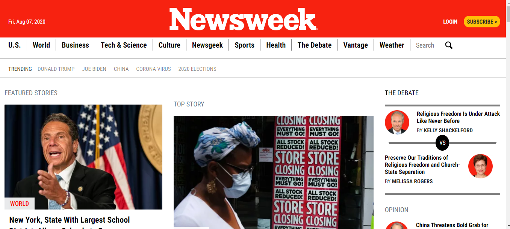

# Newsweek Clone

The Microverse "Using Bootstrap" practice that consist of creating a clone for the Newsweek Webpage https://www.newsweek.com/ where we have to build the website with the use of Bootstrap framework.

## Built With
- HTML
- CSS: flexbox, tables, linear-gradients and more.
- Bootstrap framework
- SVG's
- Google API's Font

## Authors
### Author1
- 👤GitHub: [Jose Abel Ramirez](https://github.com/jose-Abel)
- Linkedin: [Jose Abel Ramirez Frontany](https://www.linkedin.com/in/jose-abel-ramirez-frontany-7674a842/)

## Author2
- 👤GitHub: [Bbosa Muhamood](https://github.com/bmuhamood)
- Linkedin: [Bbosa Muhamood](https://www.linkedin.com/in/bbosa-muhamood-06845576)

## Getting Started
You can clone this code anytime and load the HTML on your browser, because it has SVG's needs to be loaded on a webserver so you could install the live-server package in order to display the SVG's.

## Live version
https://angry-haibt-4efacc.netlify.app/

### Setup
You can either copy the code with git clone or just do a git pull on your local environment.

### Run tests
We run the tests for the linters.yml file and everything pass!

### Acknowledgments
Appreciate the teams at Google Font's API, helps coding amazing webpages faster. Also an acknowledgment to Microverse for pushing us further to increase our knowledge.

## 📝 License
This project is MIT licensed.

## Show your support
Give a ⭐️ if you like this project!